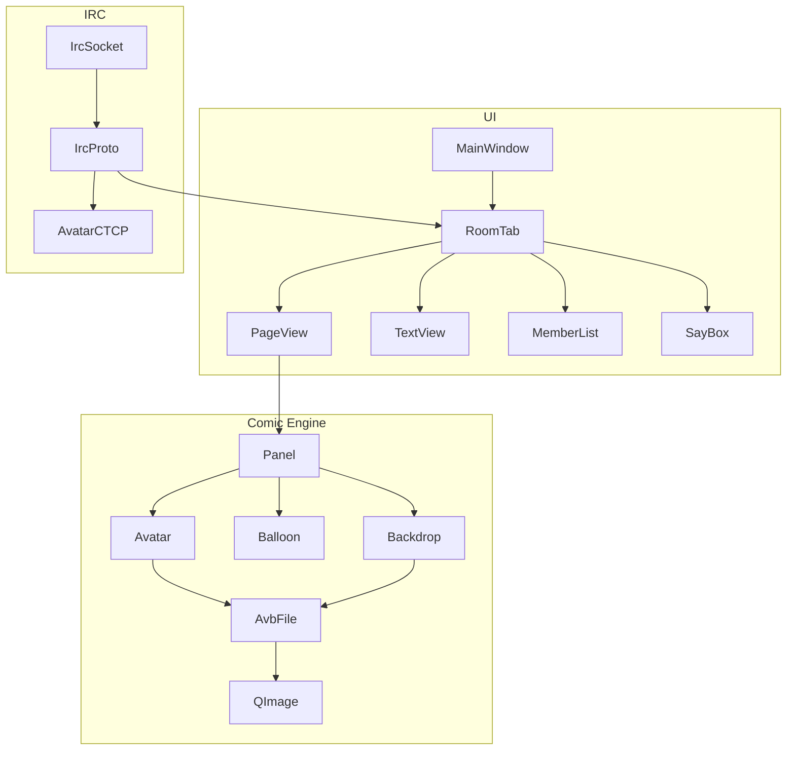

# Qt6 Comic Chat Port

## Scope (locked)
- **Full Comic Chat client**: IRC connect/join/chat, comic + text views, same `.avb`/`.bgb` loading from `comicart/`, emotions, balloons/panels, member list, setup/connect dialogs, Comic Chat CTCP extensions.
- **Skip**: NetMeeting, OLE, DCC file send, legacy MSN auth, HTTP art download to dead servers.
- **UI**: Qt main window with tabbed rooms (not MDI).
- **Layout**: headers in [`include/`](include/), sources in [`src/`](src/), CMake + Qt6, art referenced from [`v2.5-beta-1-modern/comicart/`](v2.5-beta-1-modern/comicart/).

## Architecture

## Implementation order
1. Scaffold: CMakeLists, `TODO.md`, app entry, main window shell.
2. Port AVB/BGB loader from [`avbfile.cpp`](v2.5-beta-1-modern/avbfile.cpp) / [`dib.cpp`](v2.5-beta-1-modern/dib.cpp) → `QImage`.
3. Avatar/backdrop managers (scan `comicart/*.avb`, `*.bgb`).
4. Comic panel/page view + simple balloons; emotion→pose selection.
5. IRC socket + protocol + CTCP comic extensions.
6. Wire room UI, connect/setup dialogs, text view, member list.
7. Polish: emotion rules, balloon layout fidelity, settings persistence.

## Key source references
- Format: `avbfile.h/cpp`, `avatar.h/cpp`, `avatario.cpp`, `backdrop.cpp`, `dib.cpp`
- Comic UI: `pageview.cpp`, `panel.cpp`, `balloon.cpp`, `bodycam.cpp`
- IRC: `ircsock.cpp`, `ircproto.cpp`, `chatsrv.cpp`, `protsupp.cpp`
