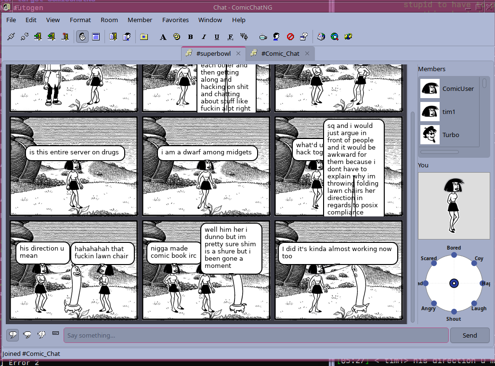

# ComicChatNG

A Qt6 reimplementation of Microsoft Comic Chat 2.5. It connects to a chat server
and renders conversation as comic-strip panels with characters, speech balloons,
and emoticons — just like the original client.



## Features

- Comic-strip view with multi-character panels and speech arrows to the head
- Say / Think / Whisper / Action balloon modes
- Character emotion picker (facial expressions)
- Original art loader (`.avb` avatar files, `.bgb` backdrop files)
- Text-view fallback with full chat history
- IRC client for real room conversations
- Classic Chat UI: full menu bar, Main/Text/Member toolbars with the original
  icon set, room properties, and tabbed Chat Options dialog

## Dependencies

- Qt 6 (Widgets, Network, Gui)
- Zlib
- A CMake + C++17 compiler

The program builds against the original art/UI resource files under
`v2.5-beta-1-modern/` (auto-copied into `res/`).

## Building

```sh
cmake -S . -B build
cmake --build build
```

Optionally install (into `build/bin/` by default):

```sh
cmake --build build --target install
```

## Running

```sh
./build/ComicChatNG
```

On first launch, pick your server, nickname and character in the connect dialog,
then connect and enter a room. If no comic art is found, browse to the
`v2.5-beta-1-modern/comicart` folder from **View → Options… → Settings**.

## Usage notes

- **Say something** in the input box and press Enter.
- Use the **Say / Think / Whisper / Action** buttons to pick how to say it.
- Right-click the comic area for view commands and room properties.
- Right-click a member for the classic member menu (profile, whisper, ignore…).
- Change your character/backdrop from the room menu.